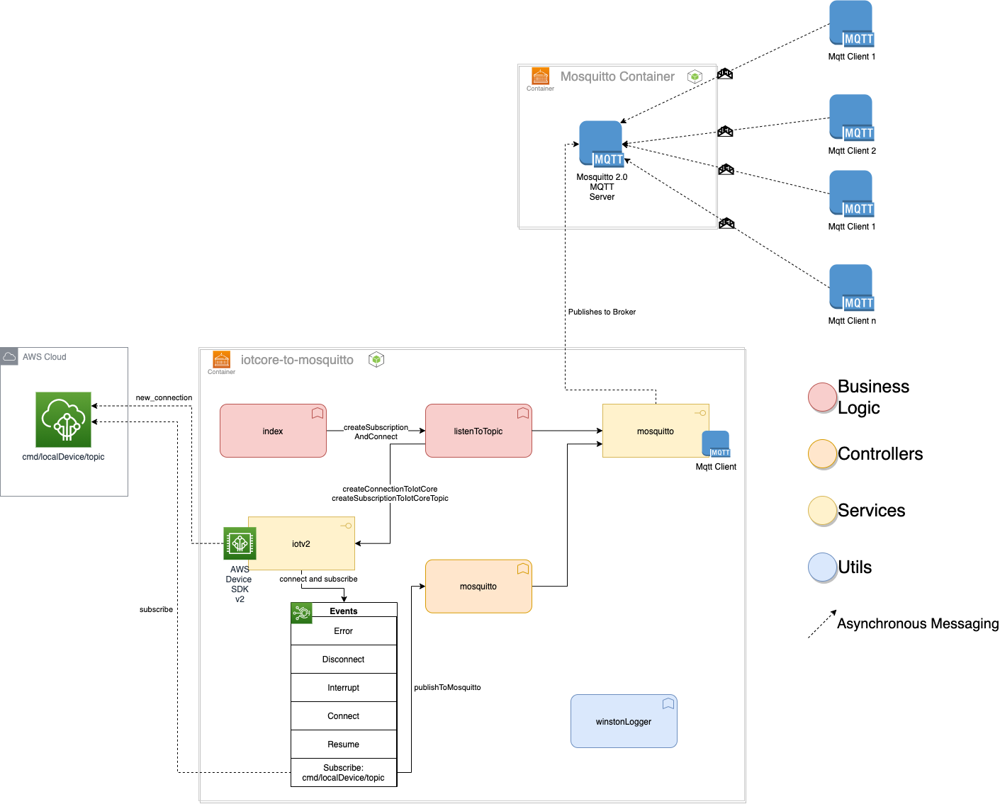

# Welcome to AWS IoT Core to Local Mosquitto Broker👋


[](#)

> In this document we built an Application that interfaces with the cloud and sends data to a local mosquitto Mqtt Broker. As of version 1.0.0 this application is only a one way communication from AWS Cloud to a Local Mosquitto broker. Future implementations will handle multi way communication. Included there is a docker file definition and a docker composer to setup the applciaiton and the mosquitto broker.

## Objectives

This Code is intended for whom is engaging with customers that need a light containerized component to communicate from AWS IoT Core to local Mosquitto broker.

## Description

This component is responsible for listening on messages on a AWS IoT Core topic in the format `cmd/localDevice/${process.env.ENV}/${process.env.DEVICE_ID}`. This is a command topic, containing information regarding on which topic the message should be published to Mosquitto Mqtt broker, the message, and just enough information to tie the received messaged to the source that generated it in the cloud. This information identifying the source is just for logging purposes.

Information is processed in the cloud and sent in the command topic to the local device. The payload should contain at least the message to be sent to mosquitto and the topic that this message should be sent to. This topic should be known beforehand.
This component is simply a bridge and should be as simple and fast as possible. Also, one assumption is that the local components are in a network constraint environment, behind the security firewalls and proxies for tsecurity purposes. For these motives, the mosquitto broker to connect allows anonymous connections without authentication.

The main function `start()` in `index.js` runs a process that create a connection configuration to AWS IoT Core based on enviromental variables containing device information, environment configuration variables and environment information, such as dev, or prod. Then, events are created to act on messages received from the cloud and the event callback function sends message to the local mosquitto broker. Aditionally the initial configuration add log capability when errors occur in the connection created to AWS IoT Core. The general overview can be seen as follows:



## Installing the Application

### Local Installation

#### Pre-requisites:

- Nodejs 14+
- Npm package Manager for the node version
- Docker
- A running container of [mosquitto broker](https://hub.docker.com/_/eclipse-mosquitto) (You can follow instructions on the mosquitto repo)

#### Install

Install all packages for development and production.

```sh
npm install
```

#### Running the application

There some options to run the application locally for development purposes. Packages dotenv and nodemon are installed from the command above and babel will be used to transpile the application.
For Environmental variables the applciaitons uses dotenv packages to build this variables, so when running locally don't forget to crate and set the .env file.

---

##### For simple local run:

> Create a .env file with the following fields and fill them with your AWS accoutn and thing data:

_Please fill all the data where the <...> are_

```sh

DEVICE_ID=<DEVICE_ID>
MQTT_BROKER_ADDRESS=<AWS_IOT_ENDPOINT>
MQTT_KEY_FILE=<DEVICE_PRIVATE_KEY>
MQTT_CERT_FILE=<DEVICE_CERTIFICATE>
MQTT_CA_FILE=<AMAZON_ROOT_CA>
MQTT_CLIENT_ID=aws_iot_core_to_mqtt_device
ENV=<YOUR_ENVIRONMENT>
# Proxy Identification for IoT using proxy
# mtls or wss
MQTT_PROTOCOL=mtls
USE_PROXY=false <true or false, wether to use proxy or not>
PROXY_HOST=<PROXY_HOSTS>
PROXY_PORT=<PROXY_PORT>
PROXY_USER=<PROXY_USER>
PROXY_PASS=<PROXY_PASSWORD>
# AWS Credentials should be Set directly in the environment, not Through the docker layer.

# Local MOsquitto MOSQUITTO_URI
MOSQUITTO_URI=<MOSQUITTO_REFERENCE_URI> # usually mqtt://localhost:1883
```

After setting the .env file, run the application.

```sh
npm run start-local
```

---

##### For simple local run with nodemon, use:

```sh
npm run start
```

---

##### For debug and better stack tracing options, use:

```sh
npm run start-debug

```

---

#### Docker Container Application

##### Building the image

Copy the things certificates and Amazon root CA of your choice to a folder in the root of the project, in the same level as the docker file, called `certs/`.


```sh
docker build -t aws-iot-core-to-mosquitto:dev\
 --build-arg ENV=`DEV`\
 --build-arg DEVICE_ID=`00123`\
 --build-arg MQTT_BROKER_ADDRESS=`TEST ADDRESS`\
 --build-arg MQTT_KEY_FILE= `MQTTFILEPRIVKEY1`\
 --build-arg MQTT_CERT_FILE=`MQTTFILECERTIFICATE`\
 --build-arg MQTT_CA_FILE=`AMAZONCAFILE`\
 --build-arg MQTT_CLIENT_ID=`ESME_ESPERANTO_NUC_LOCAL`\
 --build-arg MOSQUITTO_URI=`tcp://mosquitto:1883`  .
```

##### Running the image

```sh
docker run esperanto-station-listener:dev
```

### Cloud Installation

A docker image of this solution will be generated and stored in the clients own private ECR. This image will be generate from the Dockerfile in the root of this project.
the pipelines should be responsible for installing in the cloud.

### Run Unit tests

The test suite used for this applciation is jest. THe mocking occured as close as possible of appliccation external access.

```sh
npm run unit-test
```

### Deployment

A new push to the `dev` branch of the appplication should trigger the project pipeline for testing, linting and deployment. This application should be build following the branch strategy defined by the solution DevOps team. Which means direct pushs to the main branchs (dev and master) should not occur directly but on development branchs.

## Author

👤 **Cesar Javaroni - AWS Cloud Application Architect Consultant**
